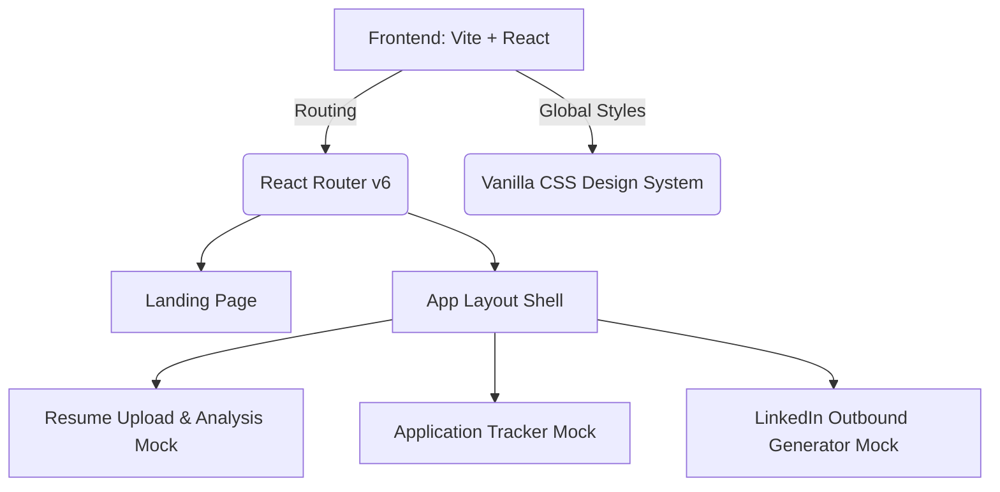

# File Explanation: README.md

## 1. What is it?
The `README.md` is the primary entry point and documentation file for the codebase. Written in Markdown, it serves as the user-facing and developer-facing guide to the project.

## 2. Why is it needed?
It provides an immediate understanding of the project's purpose, setup instructions, technology stack, folder structure, and roadmap. Any developer or stakeholder landing on the repository can use it to understand what the project is and how to get it running.

## 3. How does it work?
It uses standard Markdown formatting (headings, code blocks, bullet points, links) to organize project information. Version control platforms like GitHub or GitLab automatically render this file on the project's homepage.

## 4. Real-world example
Every major open-source repository (e.g., React, Vite, TailwindCSS) uses a `README.md` at its root to onboarding contributors, list prerequisites, and outline how to install and run the code.

## 5. Advantages
- **Fast Onboarding:** Reduces developer setup friction.
- **Clear Roadmap:** Aligns team goals visually.
- **Centralized Reference:** Saves time by preventing repeated setup questions.

## 6. Limitations
- **Maintenance Overhead:** It must be manually updated when the project architecture, scripts, or dependencies change.
- **No Verification:** Unlike code, it cannot be unit tested for accuracy.

## 7. Interview questions
- *What is the role of a README file in professional software engineering workflows?*
- *How do you ensure documentation remains in sync with the codebase as it evolves?*

## 8. Interview answers
- *Answer:* The README is the "front door" of the codebase. It defines installation procedures, project architecture, and contribution guidelines, ensuring new developers can run the app locally without needing high-touch hand-holding.
- *Answer:* By integrating documentation updates into the Definition of Done (DoD) for sprint tasks and pull requests, and by writing clear, maintainable structures that separate architectural overviews from transient code details.

---

# CareerCopilot AI

CareerCopilot AI is a production-grade startup SaaS platform designed to act as an AI-powered career manager, helping users navigate resume optimization, application tracking, interview preparation, and professional networking.

## Project Overview
CareerCopilot AI aims to streamline the modern job hunt. Finding a career is a complex, multi-variable optimization problem; this platform leverages AI to guide candidates through resume updates, outreach tracking, personalized cold email generation, and mock interview coaching.

## Architecture Roadmap


## Folder Structure
```text
careercopilot-ai/
├── docs/                      # General project and branding documentation
│   └── branding/              # Brand guidelines and design details
│       └── branding_guide.md
├── frontend/                  # React Vite Frontend SPA
│   ├── src/
│   │   ├── components/        # Reusable UI Components (Logo, etc.)
│   │   ├── layouts/           # Page Layout wrappers (AppLayout)
│   │   ├── routes/            # React Router routing configuration
│   │   ├── App.jsx            # React root component
│   │   ├── index.css          # Design system CSS tokens and classes
│   │   └── main.jsx           # Vite React mounting file
│   ├── index.html             # HTML Entry point
│   ├── package.json           # Node configuration and dependencies
│   └── vite.config.js         # Vite compilation settings
├── README.md                  # Main entry point documentation
├── PROJECT_MASTER_CONTEXT.md  # Startup product context and boundaries
├── PROJECT_DECISIONS.md       # Rationale for stack decisions
├── LEARNING_AND_INTERVIEW_GUIDE.md # Tutorial for beginners
├── DEVELOPMENT_HANDOFF.md     # Module 1.2 preparation documentation
└── INTERVIEW_MASTER_NOTES.md  # Deep technical interview notes
```

## Technology Stack
- **Library:** React 18+
- **Bundler/Build Tool:** Vite
- **Language:** JavaScript (ES6+)
- **Styling:** Vanilla CSS (CSS variables, Custom themes, Dark Blue & White palette)
- **Routing:** React Router DOM v6 (Web-standard router)

## Development Phases
- **Module 1.1:** Project Initialization, Frontend Architecture, Design System Tokens, and Developer Documentation. (Current Phase)
- **Module 1.2:** Building Landing page and interactive elements.
- **Module 2.0:** Form modules, Resume uploading mocks, Application log.
- **Module 3.0:** Advanced state tracking, dashboard widgets, and analytics mocks.
