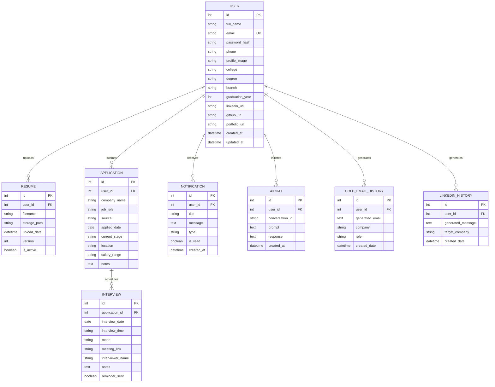

# Entity Relationship Diagram (ERD)

This document visualizes the relational schema of the CareerCopilot AI PostgreSQL database. It maps all entities, primary/foreign keys, relationship constraints, and cardinalities.

---

## 1. Mermaid ERD Visualization

---

## 2. Relationship Cardinality & Constraints

### 1. User to Resumes (One-to-Many / `1:N`)
- **Description:** A single `User` can upload multiple versions of their `Resume` over time to track career progression.
- **Constraints:**
  - **Foreign Key:** `resume.user_id` references `user.id`.
  - **Cascade Rule:** `ondelete="CASCADE"`. If a User is deleted, all their associated resumes are deleted from the database.
  - **Business Constraint:** While multiple resumes can exist, only one should have `is_active = True` to act as the primary ATS parsing document.

### 2. User to Applications (One-to-Many / `1:N`)
- **Description:** A single `User` can track many job `Applications` within their dashboard.
- **Constraints:**
  - **Foreign Key:** `application.user_id` references `user.id`.
  - **Cascade Rule:** `ondelete="CASCADE"`. Purges application logs if the user deletes their account.

### 3. Application to Interviews (One-to-Many / `1:N`)
- **Description:** A single job `Application` card can have multiple interview stages (e.g., recruiter call, technical assessment, onsite loop).
- **Constraints:**
  - **Foreign Key:** `interview.application_id` references `application.id`.
  - **Cascade Rule:** `ondelete="CASCADE"`. If an application card is deleted, all scheduled interview slots linked to it are automatically purged.

### 4. User to Notifications (One-to-Many / `1:N`)
- **Description:** A `User` receives multiple system-generated alerts or scheduled reminders.
- **Constraints:**
  - **Foreign Key:** `notification.user_id` references `user.id`.
  - **Cascade Rule:** `ondelete="CASCADE"`. Clears notification alerts on user deletion.

### 5. User to AIChats (One-to-Many / `1:N`)
- **Description:** A `User` has a conversation history containing multiple prompt/response logs.
- **Constraints:**
  - **Foreign Key:** `aichat.user_id` references `user.id`.
  - **Cascade Rule:** `ondelete="CASCADE"`.

### 6. User to Cold Email & LinkedIn History (One-to-Many / `1:N`)
- **Description:** A `User` can compile many personalized outreach letters and recruiter pitches.
- **Constraints:**
  - **Foreign Keys:** `coldemailhistory.user_id` and `linkedinhistory.user_id` reference `user.id`.
  - **Cascade Rule:** `ondelete="CASCADE"`.
