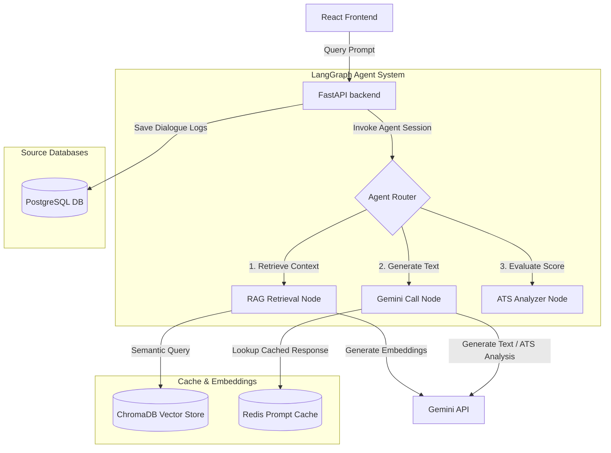

# Future AI Architecture Design

This document details the blueprint for integrating the Generative AI processing layer into CareerCopilot AI, detailing state orchestration, vector retrieval, and model caching interfaces.

---

## 1. Orchestration Model Flow

The AI subsystem utilizes a retrieval-augmented generation (RAG) architecture orchestrated by LangGraph, querying Gemini LLMs and indexing metadata inside ChromaDB.

---

## 2. Component System Integrations

### 1. LangGraph State Machine
We use **LangGraph** (instead of standard linear LangChain chains) because career coaching features (like mock interviews or iterative resume improvements) require complex state management.
- **State Object:** Tracks conversation history, candidate skills, user resumes, and interview feedback parameters.
- **Nodes:**
  - `RetrieveContextNode`: Queries ChromaDB to find matching resume sections or interview tips.
  - `LLMQueryNode`: Queries Gemini to generate emails, connection messages, or chat responses.
  - `SelfCorrectionNode`: Validates generated text against constraints (e.g. ensuring a LinkedIn connection invite is under 300 characters).

### 2. ChromaDB (Vector Store)
- **Role:** Handles Semantic Search for the resume and ATS parsing pipeline.
- **Data Pipeline:**
  1. Candidate uploads a PDF resume.
  2. The backend extracts text, segments it into chunks (e.g. 500 characters with 100 character overlap), and converts chunks into embeddings via the Gemini embeddings API.
  3. The vectorized chunks are stored in ChromaDB, mapped to the candidate's `user_id`.
  4. When auditing a job role description, ChromaDB queries the vector space to extract relevant resume highlights for comparison.

### 3. Redis (LLM Cache & Rate Limiting)
- **Prompt Caching:** Queries to LLMs can be slow and expensive. When a user requests a LinkedIn message for the same role and company repeatedly, the backend queries Redis using a SHA-256 hash of the prompt. If cached, it returns the generated message instantly without querying Gemini.

### 4. PostgreSQL (Dialogue and Audit Logging)
- Stores transactional records and conversation metadata (AIChat table logs, ColdEmailHistory logs, and user profile data).
