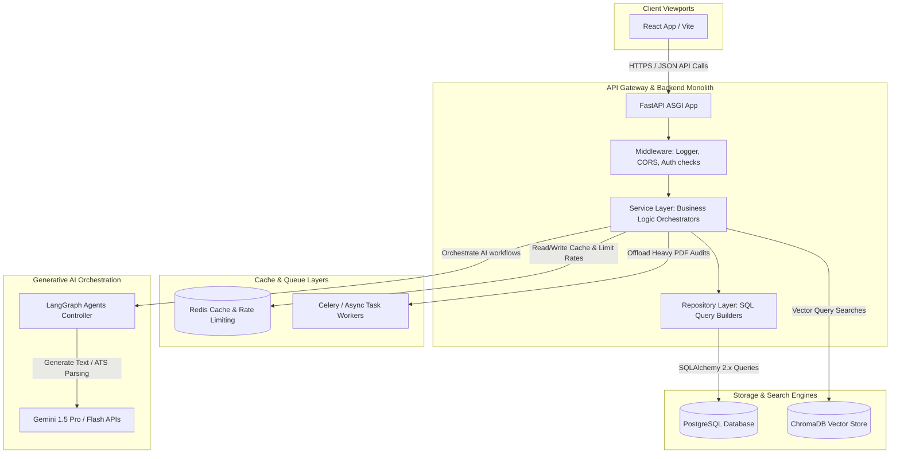
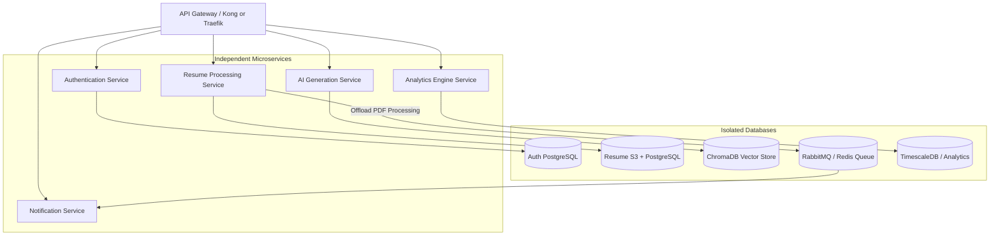

# High-Level Architecture Design (HLD) & Microservices Evolution

This document maps out the system architecture of the CareerCopilot AI platform and drafts its future evolution from a modular monolith into decoupled microservices.

---

## 1. High-Level Architecture Diagram (HLD)

The diagram below maps the interaction flow from the user's browser down to the database layers, incorporating caching, vector embeddings, and LLM orchestration.

---

## 2. Request Flow Lifecycle

1. **Browser Navigation:** The client-side React SPA makes an asynchronous HTTP request (e.g. `POST /api/v1/resumes/analyze`) carrying a JSON payload or multipart form.
2. **CORS & Middleware Audit:** The browser checks CORS headers. FastAPI's middleware intercepts the request, checks authorization headers, starts a performance timer, and routes the request.
3. **Service Layer Resolution:** The target router path forwards data parameters to the **Service Layer** (e.g. `ResumeService`). The Service Layer coordinates transaction logic.
4. **Repository & DB Querying:** The service calls the **Repository** (e.g. `ResumeRepository`). The repository executes a parameterized query using SQLAlchemy 2.0 select structures against **PostgreSQL**.
5. **Caching Integration:** The service fetches or writes cached queries to **Redis** to bypass database roundtrips.
6. **AI Orchestration (Future):** For ATS scoring, the service passes extracted PDF text coordinates to the **LangGraph** controller, which constructs prompt embeddings, queries **Gemini**, stores vectorized text in **ChromaDB**, and returns the structured evaluation feedback.
7. **Telemetry & Response:** The repository returns the data object, the service formats it, the FastAPI middleware appends duration logs, and the router returns a structured JSON payload to the React frontend.

---

## 3. Future Microservices Evolution Plan

As user traffic and system load scale, the current modular monolith can be split into independent microservices to prevent resource contention and isolate processing failures.

### Microservices Directory Decoupling Strategy

1. **Authentication Service:**
   - **Responsibility:** User registration, password verification, token issuance, and session revocation.
   - **Database:** Dedicated credentials database. Isolates sensitive user credentials from other services.
2. **Resume Processing Service:**
   - **Responsibility:** PDF uploads, text extraction, S3 storage path mapping, and ATS scanning. Offloads CPU-intensive document processing to worker queues.
   - **Database:** S3 file storage and dedicated metadata database.
3. **AI Generation Service:**
   - **Responsibility:** LangGraph workflow execution, Gemini API interactions, prompt caching, and ChromaDB vector queries. High GPU/network processing needs are isolated here.
   - **Database:** ChromaDB Vector database and Redis prompt caches.
4. **Notification Service:**
   - **Responsibility:** Email templates compilation, WebSocket connections, SMS queues, and reminder schedules.
   - **Integration:** Listens to event queues (RabbitMQ/Kafka) to trigger alerts asynchronously.
5. **Analytics Service:**
   - **Responsibility:** Tracking job funnel metrics, aggregations, conversion times, and rendering history logs.
   - **Database:** Time-series database (e.g. TimescaleDB) to optimize heavy aggregation lookups without blocking active user reads.
