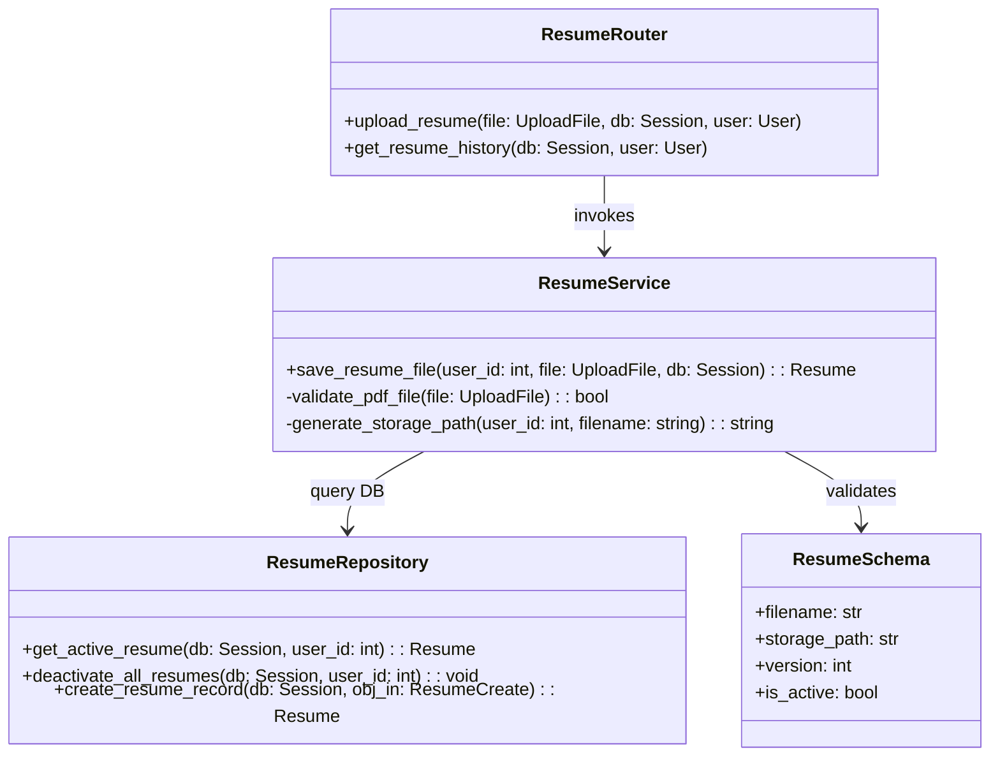
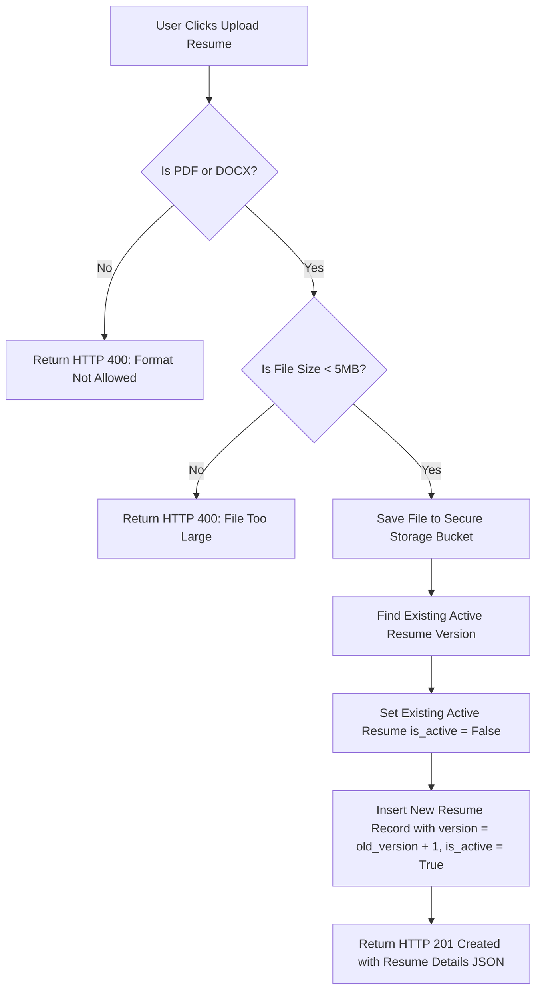
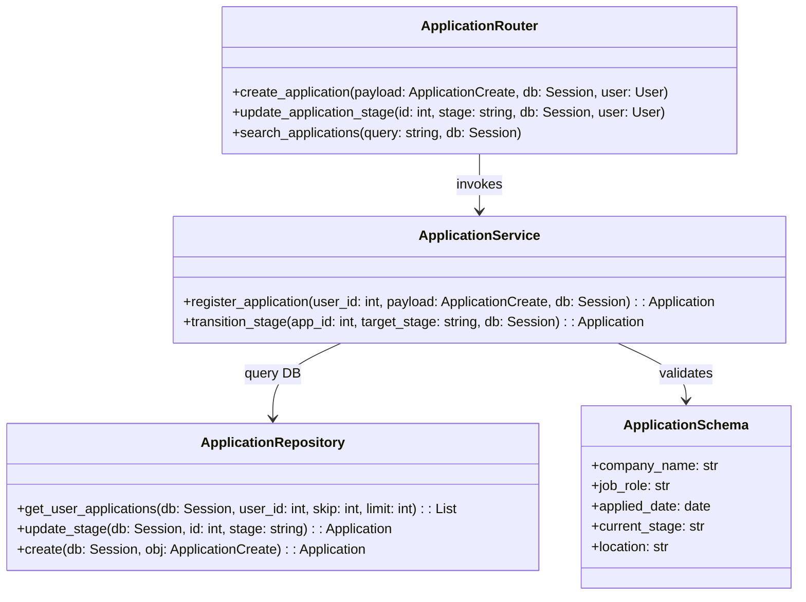
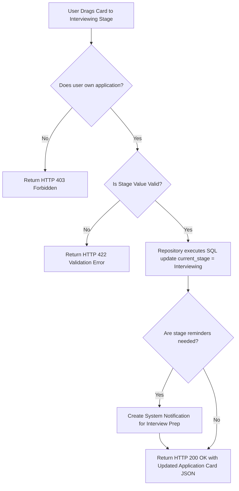

# Low-Level Design (LLD): Resume Upload & Application Tracker

This document provides detailed class layouts, schema validation rules, repository query interfaces, and logical process flows for the **Resume Upload** and **Application Tracker** features.

---

## 1. LLD: Resume Upload Flow

The Resume Upload feature handles multipart file uploads, file size checks, S3 path generation, version increments, and active-state configuration.

### Class & Module Relationships

### Resume Versioning & Upload Flowchart

---

## 2. LLD: Application Tracker Flow

The Application Tracker handles creating application cards, tracking stages, recording notes, and updating stages on board drag-and-drop.

### Class & Module Relationships

### Stage Transition Flowchart

