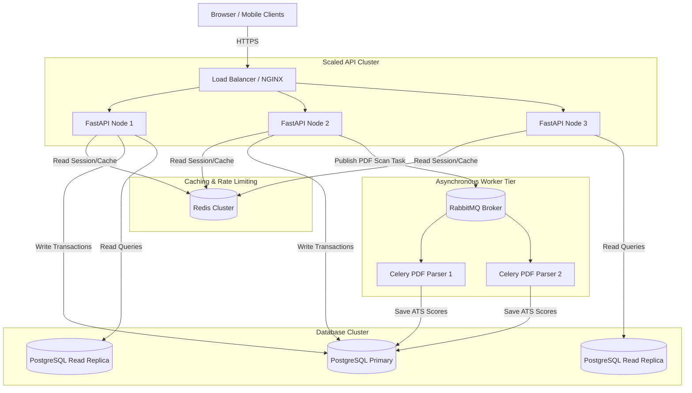

# Scalability Plan: From Prototype to 1 Million Users

This document outlines the scaling roadmap for CareerCopilot AI, detailing structural adjustments, caching tiers, and queuing configurations required to support different user volumes.

---

## 1. Scaling Phases

### Phase 1: Prototype (10 Users)
- **Deployment:** Single host instance (e.g. AWS EC2 t4g.micro or Render hobby tier).
- **Database:** PostgreSQL running on the same host or a lightweight managed instance.
- **Queue/Cache:** In-memory async tasks (FastAPI `BackgroundTasks`).
- **Characteristics:** Minimal cost, simple deployment, fast iteration.

### Phase 2: Growth (10,000 Users)
- **Deployment:** Separate frontend (S3/Vercel CDN) and backend API instances. 
- **Database:** Managed PostgreSQL (e.g., AWS RDS gp3) with vertical scaling.
- **Connection Pooling:** **PgBouncer** is integrated to reuse database connections, preventing connection leaks.
- **Caching Layer:** **Redis** is introduced to cache frequently accessed user profiles and configuration metadata.
- **Asynchronous Processing:** Heavy tasks (like PDF parsing) are offloaded to **Celery workers** backed by a Redis message broker.

### Phase 3: Scale (1,000,000 Users)
- **Architecture:** Horizontal scaling with decoupled services.
- **API Routing:** **Load Balancer** (e.g., AWS Application Load Balancer or NGINX) distributes incoming traffic across multiple FastAPI containers.
- **Database:**
  - One primary database instance for writes.
  - Multiple **Read Replicas** to offload read traffic (e.g. dashboard reads, search queries).
- **Caching:** Distributed **Redis Cluster** handles session states, rate limits, and database query cache grids.
- **Asynchronous Task Queue:** Celery workers backed by **RabbitMQ** to handle background tasks like resume parsing and PDF scoring.
- **Vector DB Scaling:** ChromaDB deployed as a distributed cluster to handle vector embeddings search for AI queries.

---

## 2. Infrastructure Flow at Scale

The diagram below maps where load balancers, Redis caches, and background workers fit in a high-scale deployment.

---

## 3. Bottleneck Mitigations

1. **Database Connection Limits:** PostgreSQL uses a process-per-connection model. Spawning 100 API containers could exhaust database connections. Placing **PgBouncer** in transaction-pooling mode limits the connection count on the database.
2. **AI API Rate Limits:** Queries to the Gemini API are rate-limited. We cache generated outreach letters and ATS reports in Redis, preventing redundant LLM queries.
3. **Heavy CPU Tasks:** Converting PDFs and calculating ATS match percentages is CPU-intensive. Running these queries inside FastAPI's request-response loop would block incoming requests. Offloading these tasks to **Celery workers** ensures the API remains responsive.
