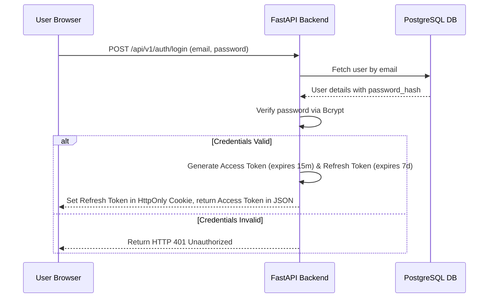

# Security Design Document

This document defines the security architecture, cryptography methods, data validation, and session policies for the CareerCopilot AI platform.

---

## 1. Authentication Strategy (JWT)

We design a stateless token-based authentication system using **JSON Web Tokens (JWT)**.

### Access Token vs. Refresh Token Specs
1. **Access Token:**
   - **Type:** JSON Web Token signed with `HS256`.
   - **Lifespan:** 15 minutes.
   - **Payload Content:** Includes `sub` (User ID), `email`, and `exp` (expiration timestamp).
   - **Storage:** Stored in browser memory (never in localStorage to prevent XSS theft). Sent via the `Authorization: Bearer <token>` header.
2. **Refresh Token:**
   - **Lifespan:** 7 days.
   - **Storage:** Stored as an `HttpOnly`, `Secure`, `SameSite=Strict` cookie.
   - **Security Benefits:** Cannot be read by JavaScript, protecting the session from XSS hijacking. Used only to request a new access token at `/api/v1/auth/refresh`.

---

## 2. Password Hashing (Bcrypt)

- **Algorithm:** **Bcrypt (Blowfish file-encryption algorithm)**.
- **Salt Generation:** Autogenerated 12-round salt (`work_factor = 12`).
- **Storage Field:** Stored in the `user.password_hash` column (`VARCHAR(255)`).
- **Verification Flow:** The raw password input during login is compared to the stored hash using `bcrypt.checkpw(password.encode('utf-8'), stored_hash.encode('utf-8'))`.

---

## 3. CORS Policy (Cross-Origin Resource Sharing)

- **Default Rules:** All endpoints restrict cross-origin access by default.
- **Authorized Origins:** Configured via `BACKEND_CORS_ORIGINS` in Pydantic settings. Only Vite development origins (`http://localhost:5173`) are whitelisted for local testing.
- **Preflight Responses:** The API gateway intercepts standard preflight browser requests (`OPTIONS`) and returns the following headers:
  - `Access-Control-Allow-Origin: http://localhost:5173`
  - `Access-Control-Allow-Credentials: true` (necessary to allow HttpOnly cookies)
  - `Access-Control-Allow-Methods: GET, POST, PUT, PATCH, DELETE, OPTIONS`

---

## 4. Input Validation & Schema Sanitization

- **Validation Engine:** Pydantic is used to sanitize incoming request bodies against predefined schemas.
- **Payload Gates:** Any parameter matching incorrect types, negative values, or exceeding length bounds (e.g. email > 100 characters) is immediately rejected with an `HTTP 422 Unprocessable Entity` status before executing database queries, preventing SQL injection and heap overflows.

---

## 5. Rate Limiting (Future)

To protect the server from Denial of Service (DoS) and brute-force attacks, we will implement rate-limiting middleware in the future:
- **Storage Backend:** Redis.
- **Limiting Algorithm:** Token Bucket.
- **Limits Enforced:**
  - **Auth routes (`/login`, `/register`):** Maximum 5 requests per minute per IP address.
  - **General routes:** Maximum 100 requests per minute per user ID.
- **Failure Response:** Returns `HTTP 429 Too Many Requests` carrying a `Retry-After` header.

---

## 6. CSRF & XSS Considerations

### Cross-Site Scripting (XSS) Mitigation
- Access tokens are stored in browser memory, and refresh tokens are stored in `HttpOnly` cookies. This ensures that even if a malicious script runs on the page, it cannot extract active credentials.
- Input validation sanitizes strings to escape HTML tags, preventing stored XSS.

### Cross-Site Request Forgery (CSRF) Mitigation
- Since refresh tokens are sent via cookies, we use the `SameSite=Strict` attribute. This ensures browsers do not attach the cookie to cross-origin requests, blocking CSRF attacks.
