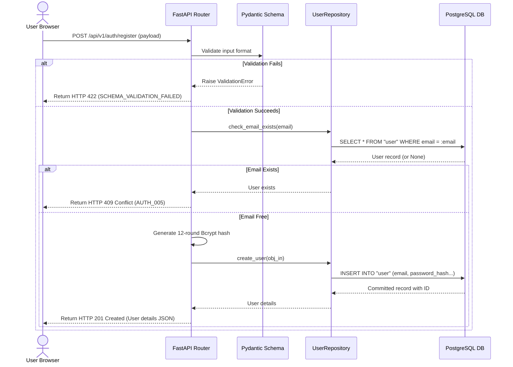
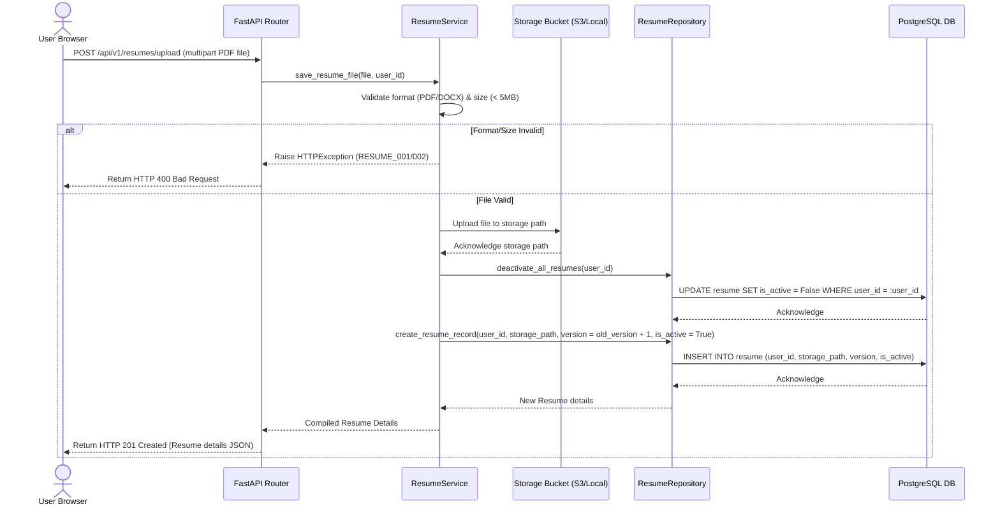
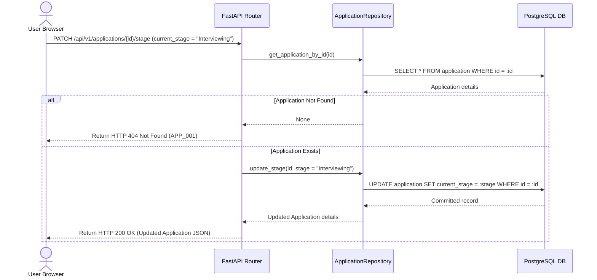
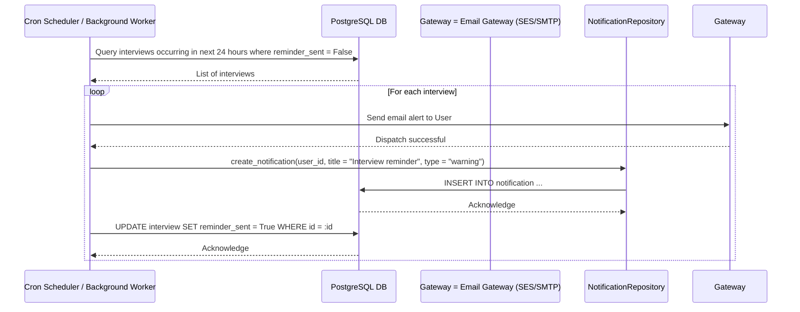
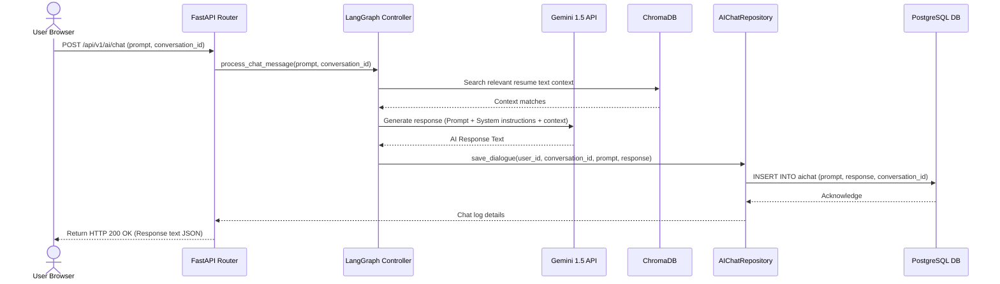
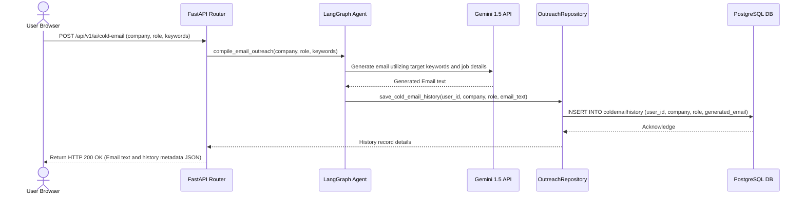

# System Sequence Diagrams

This document maps out the system sequence interactions between the React Frontend, FastAPI Backend, Repositories, Databases, and external service agents for critical user flows.

---

## 1. User Registration Flow

---

## 2. Resume Upload & Active Versioning Flow

---

## 3. Application Tracking Flow

---

## 4. Scheduled Interview Reminder Cron Flow

---

## 5. AI Chat Dialogue Flow

---

## 6. Outreach Cold Email Generation Flow

